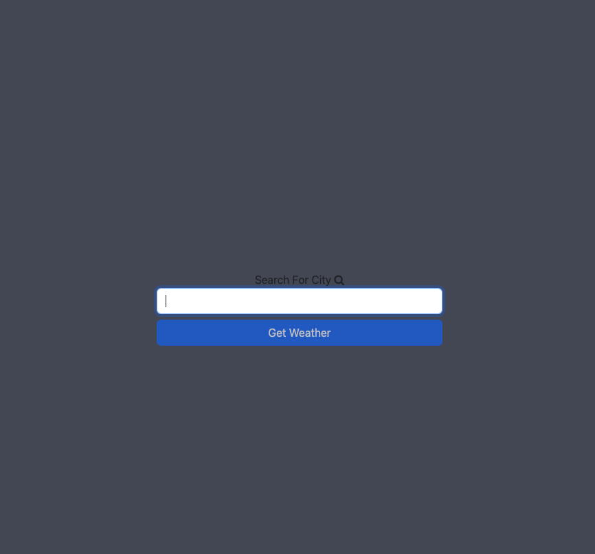
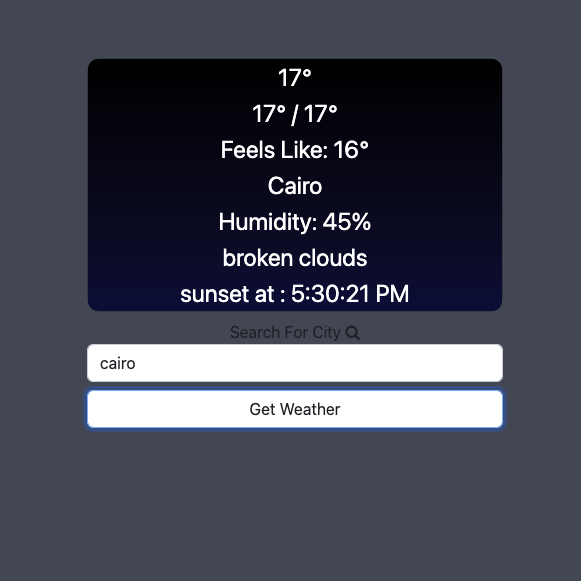

# Weather App 

checking weather using  " https://api.openweathermap.org " 

This project was generated with Angular CLI version 15.1.1.

## Clone this repo and run " npm install" to install dependencies 

